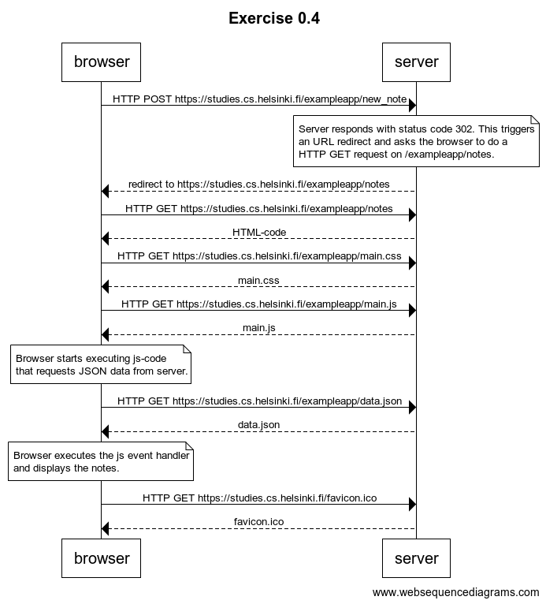
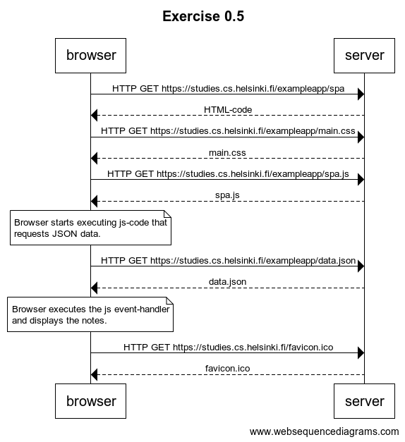
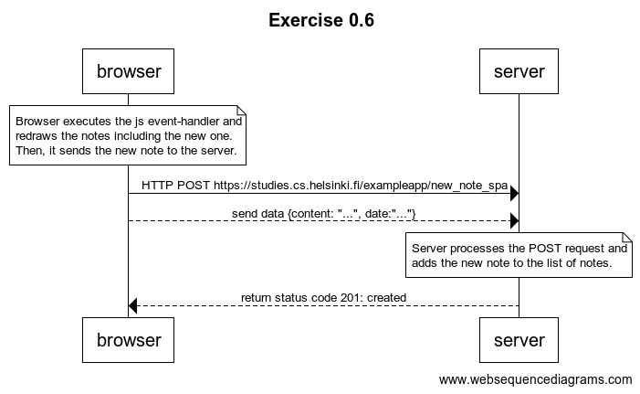

# Solutions Exercises Part 0
The first three exercises are research questions only and therefore not included here.

## 0.4 New note
Create a diagram depicting the situation where the user creates a new note on page https://studies.cs.helsinki.fi/exampleapp/notes when writing something into the text field and clicking the submit button.

## 0.5 Single page app
Create a diagram depicting the situation where the user goes to the single page app version of the notes app at https://studies.cs.helsinki.fi/exampleapp/spa.

## 0.6 New note (single page app)
Create a diagram depicting the situation where the user creates a new note using the single page version of the app.

